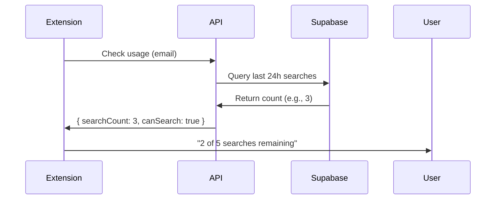

# 🔒 Backend Setup for Search Tracking (Cloudflare + Supabase)

## 📋 Complete Implementation Guide

This folder contains everything you need to implement server-side search tracking and fix the search exploit vulnerability.

---

## 🚀 Quick Start (5 Steps)

### Step 1: Create Supabase Table ⏱️ 2 minutes
**File:** `STEP_1_SUPABASE_TABLE.sql`

1. Open [Supabase Dashboard](https://supabase.com/dashboard)
2. Go to **SQL Editor** → **New Query**
3. Copy & paste entire contents of `STEP_1_SUPABASE_TABLE.sql`
4. Click **Run**
5. ✅ Verify: You should see "Table created" message

---

### Step 2: Configure Environment Variables ⏱️ 3 minutes
**File:** `STEP_2_ENV_VARIABLES.md`

1. Get your Supabase credentials:
   - **Project URL:** Supabase Dashboard → Settings → API → Project URL
   - **Service Role Key:** Settings → API → service_role key

2. Add to Cloudflare:
   - Cloudflare Dashboard → Pages → tabmangment.com
   - Settings → Environment Variables → Add
   - Add both `SUPABASE_URL` and `SUPABASE_SERVICE_ROLE_KEY`

---

### Step 3: Deploy API Endpoints ⏱️ 5 minutes
**Files:**
- `STEP_3_API_check-search-usage.js`
- `STEP_3_API_increment-search.js`

1. In your `tabmangment.com` project, create:
   ```
   /functions/api/check-search-usage.js
   /functions/api/increment-search.js
   ```

2. Copy the code from Step 3 files to these locations

3. Install dependencies:
   ```bash
   npm install @supabase/supabase-js
   ```

---

### Step 4: Deploy to Cloudflare ⏱️ 2 minutes

**Option A: Git Push (Easiest)**
```bash
git add .
git commit -m "Add search tracking API endpoints"
git push
```
Cloudflare auto-deploys on push ✅

**Option B: Manual Deploy**
- Cloudflare Dashboard → Pages → Deployments → Create deployment

---

### Step 5: Test It Works ⏱️ 3 minutes
**File:** `STEP_5_DEPLOYMENT_GUIDE.md`

Run these tests:

```bash
# Test 1: Check search usage
curl -X POST https://tabmangment.com/api/check-search-usage \
  -H "Content-Type: application/json" \
  -d '{"email":"test@example.com"}'

# Test 2: Record a search
curl -X POST https://tabmangment.com/api/increment-search \
  -H "Content-Type: application/json" \
  -d '{"email":"test@example.com"}'
```

Expected: Both should return `{"success": true, ...}`

---

## 📁 File Manifest

| File | Purpose | Time |
|------|---------|------|
| `STEP_1_SUPABASE_TABLE.sql` | Create database table | 2 min |
| `STEP_2_ENV_VARIABLES.md` | Set up secrets | 3 min |
| `STEP_3_API_check-search-usage.js` | Check usage endpoint | - |
| `STEP_3_API_increment-search.js` | Record search endpoint | - |
| `STEP_4_PACKAGE_JSON.json` | Dependencies | 1 min |
| `STEP_5_DEPLOYMENT_GUIDE.md` | Deploy & test guide | 5 min |

**Total time:** ~15 minutes ⏱️

---

## ✅ What This Fixes

### Before (Exploitable):
- User performs 5 searches → limit reached
- User logs out → `chrome.storage.local` cleared
- User logs back in → search count reset to 0
- User can search 5 more times (unlimited exploit!)

### After (Secure):
- User performs 5 searches → limit reached
- Backend records in Supabase database
- User logs out → data persists in database
- User logs back in → API fetches real count from database
- User CANNOT search more (exploit fixed! ✅)

---

## 🔍 How It Works



---

## 🛠️ Troubleshooting

### "Environment variables not defined"
- Check Cloudflare Dashboard → Environment Variables
- Ensure both `SUPABASE_URL` and `SUPABASE_SERVICE_ROLE_KEY` are set
- Redeploy after adding variables

### "Table does not exist"
- Run `STEP_1_SUPABASE_TABLE.sql` in Supabase SQL Editor
- Verify table name is exactly `search_usage` (lowercase)

### "CORS error"
- API endpoints include CORS headers (`Access-Control-Allow-Origin: *`)
- If still blocked, check Cloudflare → Workers → CORS settings

### "Database connection failed"
- Verify Supabase project is active
- Check service role key is correct (starts with `eyJ...`)
- Ensure RLS policies allow service role access

---

## 📊 Monitoring

### View Search Usage
```sql
-- Run in Supabase SQL Editor
SELECT
  user_email,
  COUNT(*) as searches_24h,
  MAX(searched_at) as last_search
FROM search_usage
WHERE searched_at > NOW() - INTERVAL '24 hours'
GROUP BY user_email
ORDER BY searches_24h DESC;
```

### View Logs
- Cloudflare Dashboard → Workers & Pages → Logs
- Real-time stream shows all API calls

---

## 🎯 Success Criteria

- [x] Extension deployed with backend API calls
- [ ] Supabase table created and indexed
- [ ] Environment variables configured
- [ ] API endpoints deployed to Cloudflare
- [ ] Test user can perform 5 searches
- [ ] Test user CANNOT perform 6th search
- [ ] Test logout/login preserves search count
- [ ] Test Pro users have unlimited searches

---

## 🚨 IMPORTANT

**Deploy Priority:** CRITICAL
**Time Estimate:** 15 minutes
**Impact:** Prevents unlimited search exploit

---

## 🔗 Related Files

- Extension code: `/popup.js` (already updated)
- Config: `/config.js` (already updated)
- Documentation: `/BACKEND_API_REQUIREMENTS.md`

---

## 📞 Support

If you encounter issues:
1. Check the troubleshooting section above
2. Review Cloudflare logs for errors
3. Verify Supabase table structure
4. Test endpoints with curl commands

---

**Ready to implement? Start with Step 1! 🚀**
